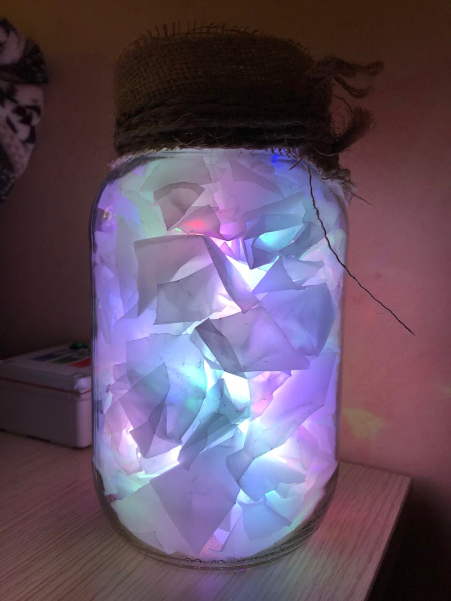
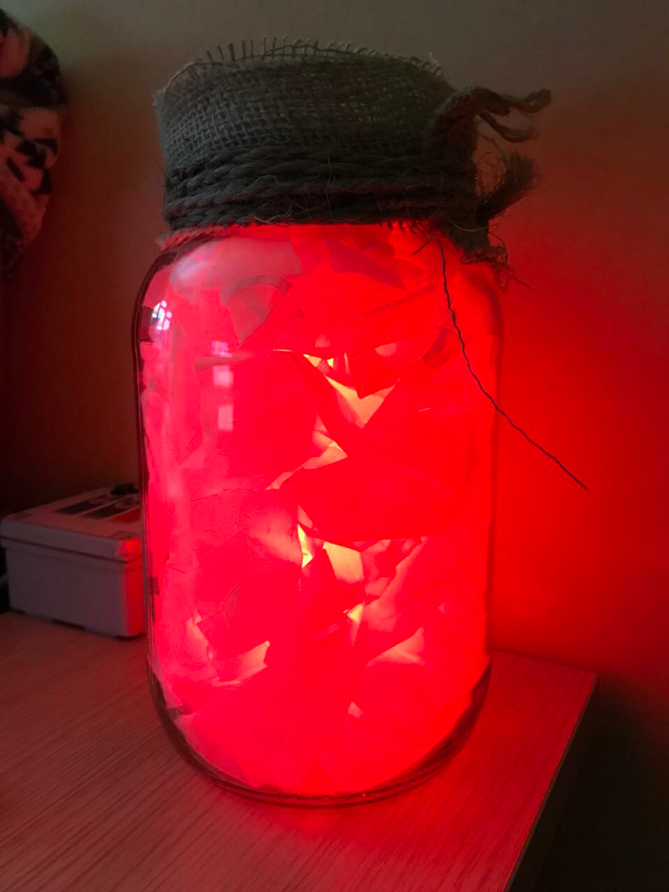
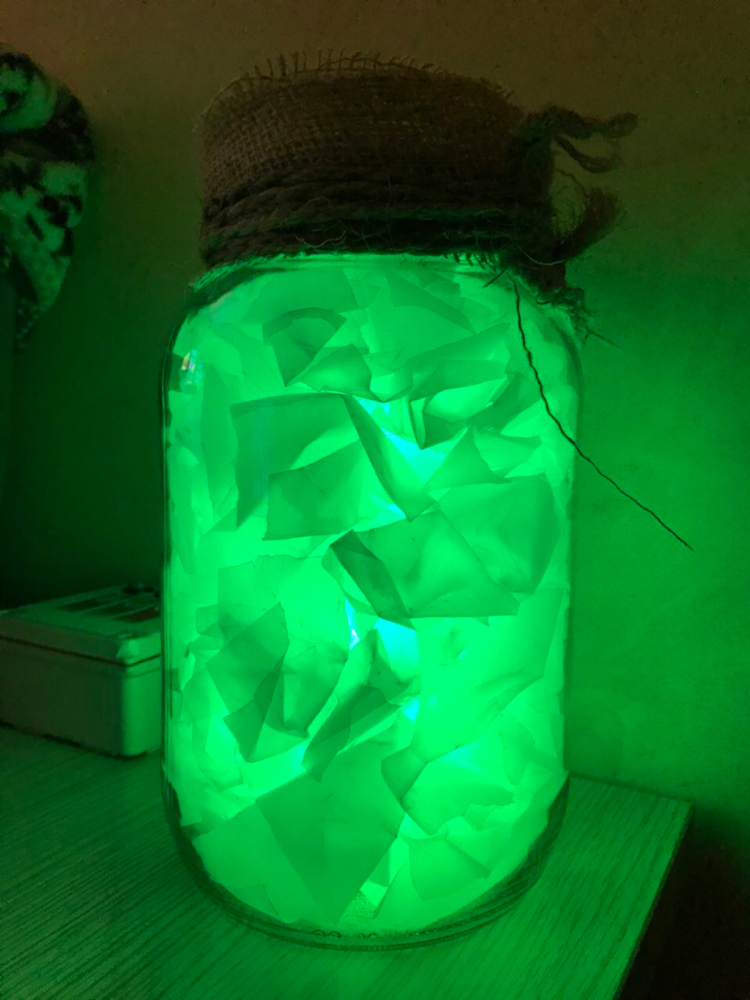
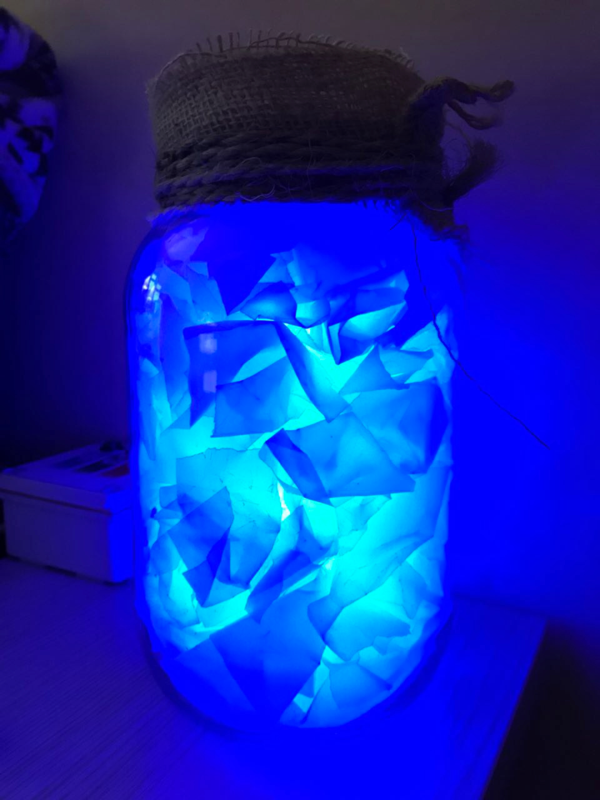
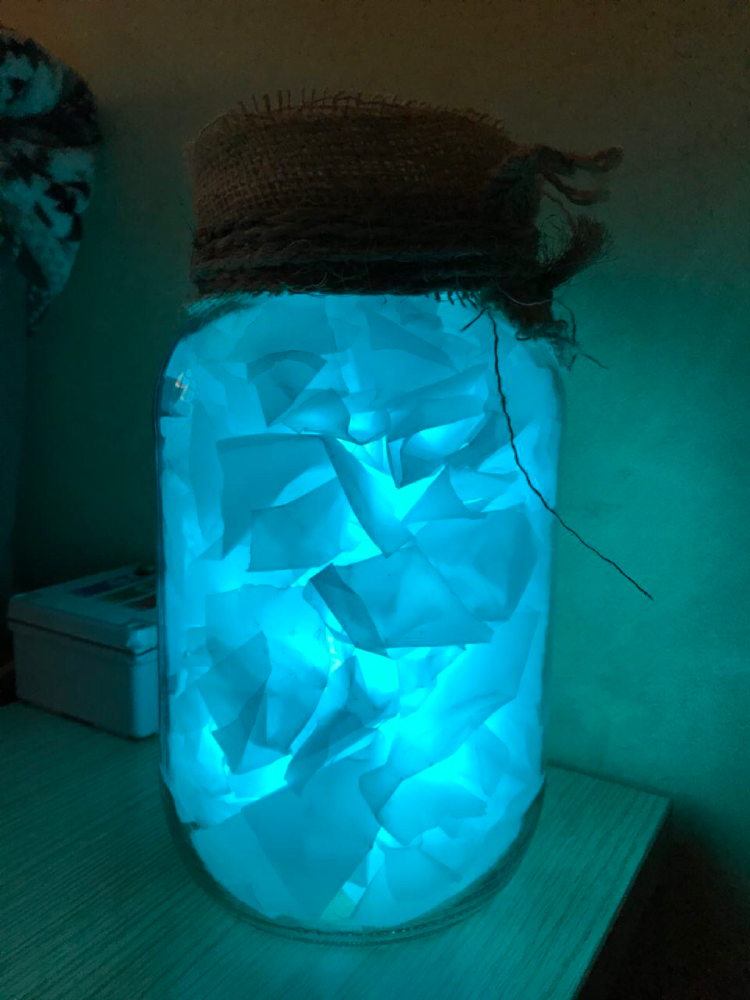
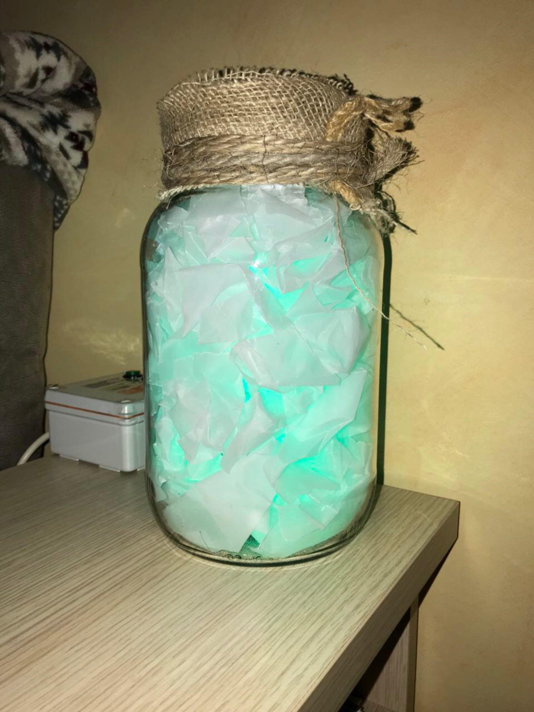
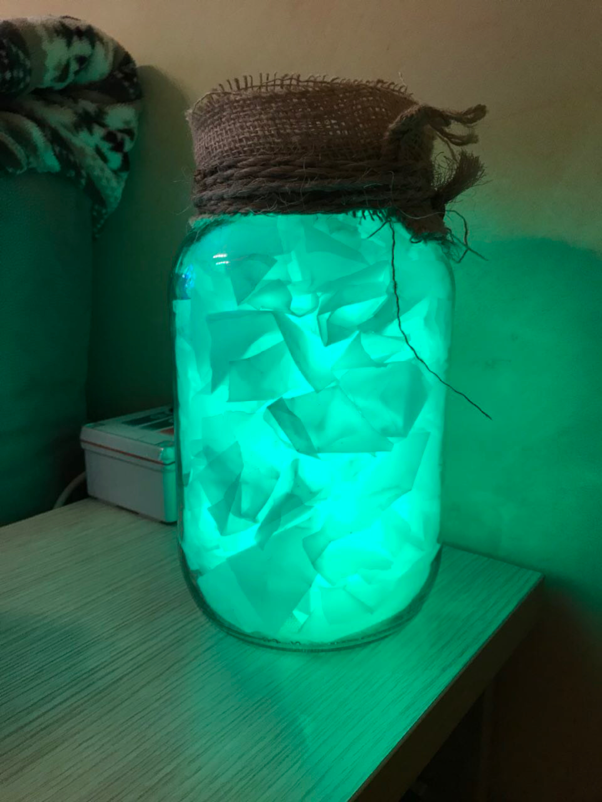
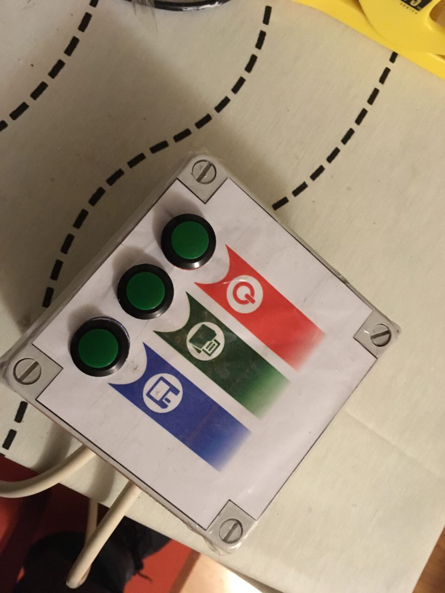

# RaibowLedLamp

## Intro

This is a RGB (Red Green Blue) lamp based on Arduino and led strip lights. There is also a control box to set the light color.

## Hardware

1. Arduino nano
2. Led Strip
3. Three push button
4. Power supply (Vin: 220AC Vout: 5V, 3 A)
5. Big crystal jar
6. Onion paper???

## Pictures

## Thanks to Henri-K for his WS2812 library:

### [https://github.com/cpldcpu/light_ws2812/tree/master/light_ws2812_Arduino](https://github.com/cpldcpu/light_ws2812/tree/master/light_ws2812_Arduino)
